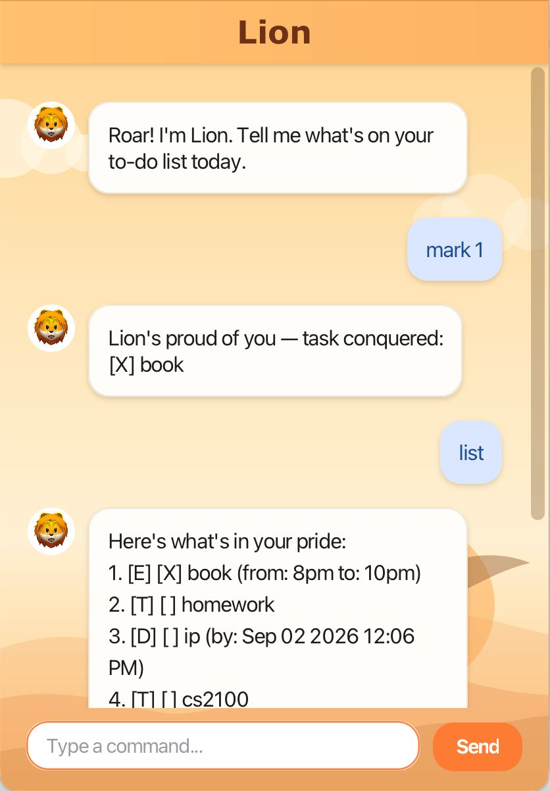

# Lion User Guide

Lion is a desktop app for tracking your to-dos, deadlines, and events, via a chat window — type a command and Lion replies instantly. If you can type fast, Lion gets your tasks organized faster than any mouse-driven app.



## Quick start

1. Ensure you have **Java 25** installed on your computer.
2. Download the latest `lion.jar` from the [releases page](https://github.com/glory-lion/ip/releases).
3. Copy the file into the folder you want to use as the home folder for Lion.
4. Open a terminal in that folder and run:
   ```
   java -jar lion.jar
   ```
   A chat window should appear in a few seconds.
5. Type a command into the box at the bottom and press Enter or click **Send**. Try `help` to see everything Lion can do.
6. Refer to the [Features](#features) below for details of each command.

Lion saves your tasks to disk automatically after every change, so they'll still be there the next time you open it.

## Features

### Viewing all tasks: `list`

Shows every task you've added, numbered in the order you added them.

Example: `list`

```
Here's what's in your pride:
1. [T] [ ] homework
2. [D] [ ] ip (by: Sep 02 2026 12:06 PM)
3. [T] [ ] cs2100
```

Each task starts with a type icon (`T` = todo, `D` = deadline, `E` = event) and a checkbox showing whether it's done.

### Adding a todo: `todo DESCRIPTION`

Adds a task with no date attached.

Example: `todo read book`

```
Roar! Added to your pride:
[T] [ ] read book
Your pride now has 1 tasks
```

### Adding a deadline: `deadline DESCRIPTION /by DATE_TIME`

Adds a task that's due by a specific date and time. `DATE_TIME` must be in the format `d/M/yyyy HHmm` (24-hour time), e.g. `2/12/2026 1800` for 2 December 2026, 6pm.

Example: `deadline return book /by 2/12/2026 1800`

```
Roar! Added to your pride:
[D] [ ] return book (by: Dec 02 2026 6:00 PM)
Your pride now has 1 tasks
```

Dates that don't exist on the calendar (like 30 February) are rejected — Lion will ask you to double-check the date.

### Adding an event: `event DESCRIPTION /from START /to END`

Adds a task that runs from a start to an end. `START`/`END` can be plain text (e.g. `Monday 2pm`) or a full date-time in the same format as deadlines — if you give both as full dates, the start must come before the end.

Example: `event project meeting /from Mon 2pm /to Mon 4pm`

```
Roar! Added to your pride:
[E] [ ] project meeting (from: Mon 2pm to: Mon 4pm)
Your pride now has 1 tasks
```

### Marking a task as done: `mark INDEX`

Marks the task at the given number (from `list`) as done.

Example: `mark 1`

```
Lion's proud of you — task conquered:
[X] read book
```

### Marking a task as not done: `unmark INDEX`

Reverses `mark` — marks the task as not done.

Example: `unmark 1`

```
Back to the hunt — task reopened:
[ ] read book
```

### Deleting a task: `delete INDEX`

Removes the task at the given number.

Example: `delete 1`

```
Lion's let this one go:
[T] [ ] read book
Your pride now has 0 tasks
```

### Finding tasks: `find KEYWORD`

Lists tasks whose description contains the keyword (case-sensitive).

Example: `find book`

```
Lion tracked down these matching tasks:
1. [T] [ ] read book
```

### Viewing all commands: `help`

Lists every command with a short description — handy if you forget the syntax mid-chat.

### Exiting: `bye`

Says goodbye. You can also just close the window — your tasks are already saved.

### Errors

If a command is malformed, empty, refers to a task number that doesn't exist, or would create an invalid task (like an event ending before it starts), Lion replies with a `ROAR!!! ...` message explaining what to fix, and leaves your task list unchanged.

## Command summary

| Action | Format | Example |
|---|---|---|
| List | `list` | `list` |
| Todo | `todo DESCRIPTION` | `todo read book` |
| Deadline | `deadline DESCRIPTION /by DATE_TIME` | `deadline return book /by 2/12/2026 1800` |
| Event | `event DESCRIPTION /from START /to END` | `event meeting /from Mon 2pm /to Mon 4pm` |
| Mark | `mark INDEX` | `mark 1` |
| Unmark | `unmark INDEX` | `unmark 1` |
| Delete | `delete INDEX` | `delete 1` |
| Find | `find KEYWORD` | `find book` |
| Help | `help` | `help` |
| Bye | `bye` | `bye` |
